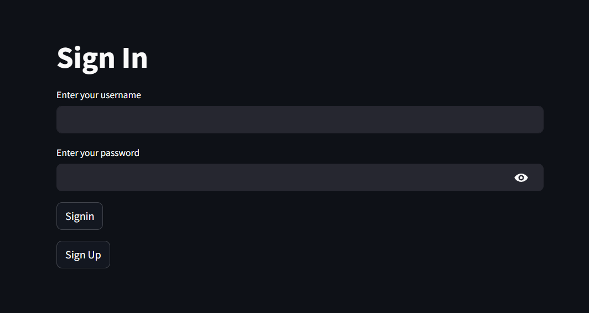
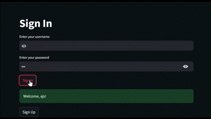
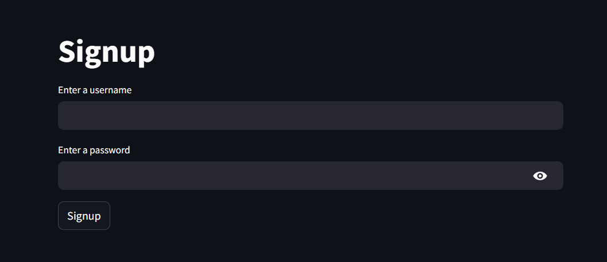
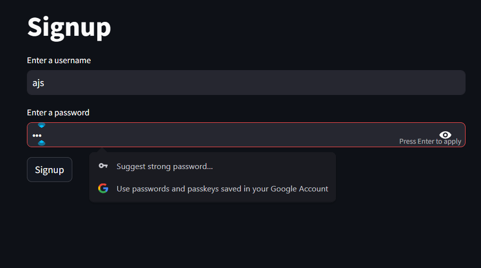
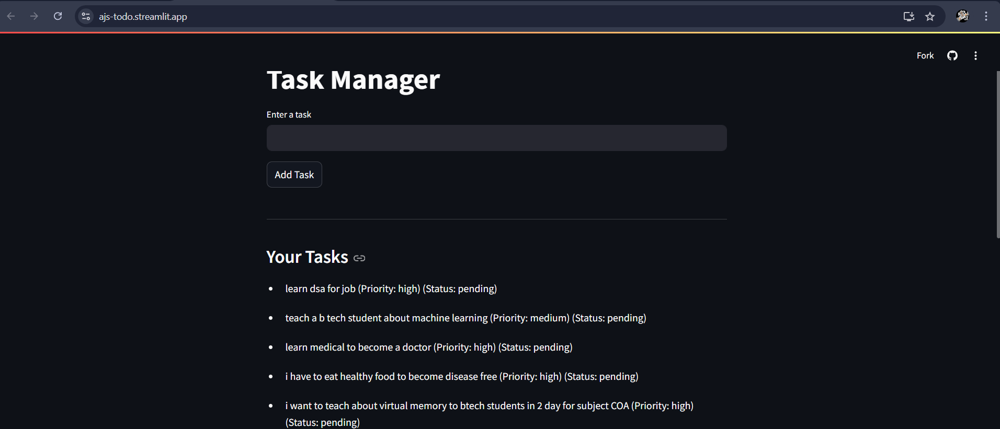
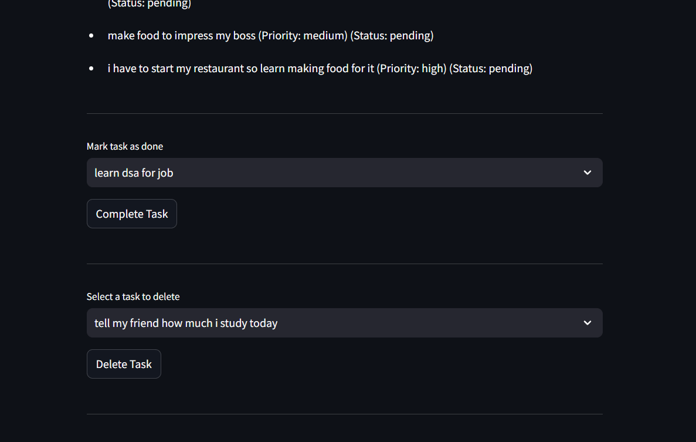
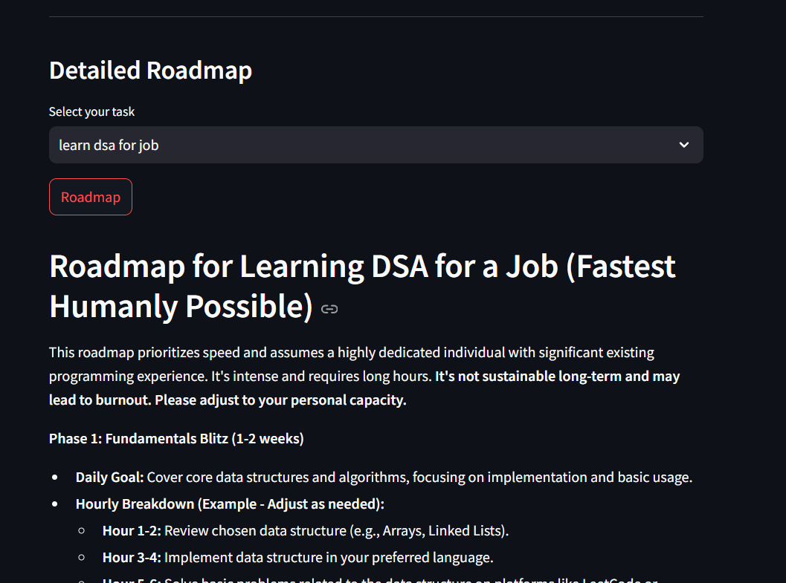
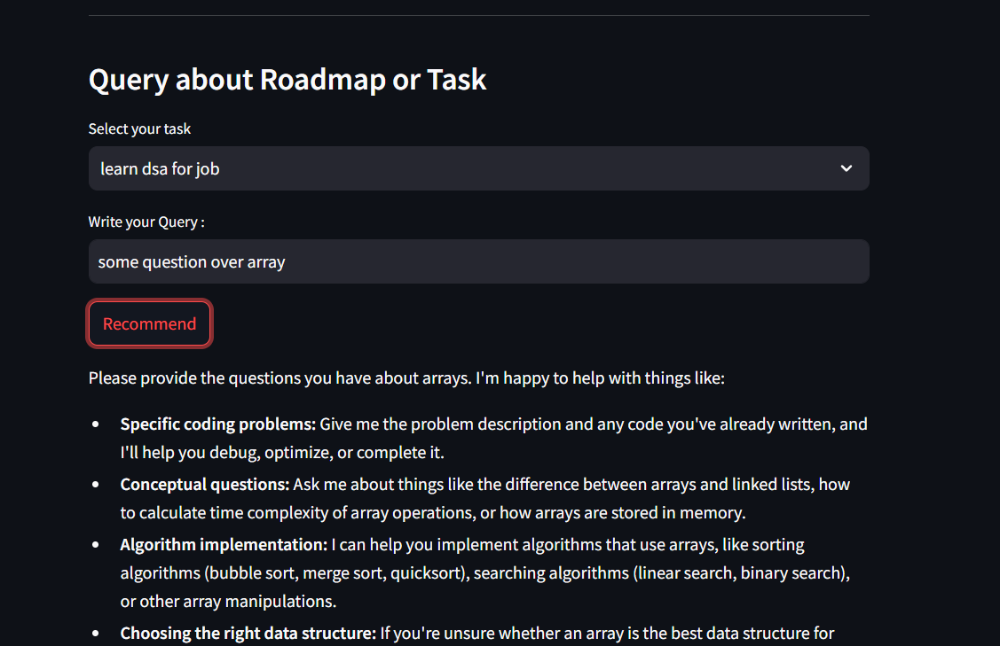
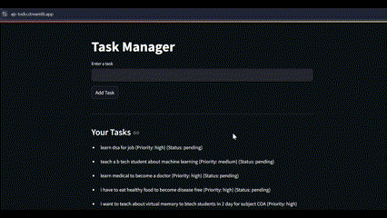

# AI Powered TODO App

Welcome to the TODO App — a streamlined and intelligent task management solution! This app is designed to help you manage your daily tasks and schedules efficiently while leveraging the power of AI to provide personalized guidance for your goals.

## 🚀 Features
- **Streamlit Frontend**: A clean and interactive user interface built using the `streamlit` library in Python.
- **AI-Powered Personal Tutor**: 
  - Uses the **Gemini API** to generate AI-based personalized roadmaps, schedules, or suggestions for your tasks.
  - Acts as a virtual assistant to optimize your workflow and enhance productivity.
- **MongoDB Integration**:
  - Stores and manages user tasks with a robust and scalable database.
- **Google Calendar Integration**:
  - Allows users to save their AI-generated timetables or roadmaps directly into their Google Calendar for easy accessibility and reminders.

## 📚 How It Works
1. **Add Tasks**: Input tasks and categorize them.
2. **Get AI Suggestions**: Use the AI-powered tutor to generate a personalized roadmap or study plan for your tasks.
3. **Save to Calendar**: Seamlessly save your schedules to Google Calendar for better time management.
4. **Track and Manage**: View and edit tasks as needed within the app.

## 🛠️ Technologies Used
- **Frontend**: [Streamlit](https://streamlit.io/)
- **AI Integration**: Gemini API
- **Database**: [MongoDB](https://www.mongodb.com/)
- **Calendar Integration**: [Google Calendar API](https://developers.google.com/calendar)

## 🖥️ Setup and Installation
Follow these steps to set up the project on your local system:

1. **Clone the Repository**:
   ```bash
   git clone https://github.com/your-username/todo-app.git
   cd todo-app
   ```

2. **Create a Virtual Environment**:
   ```bash
   python -m venv venv
   source venv/bin/activate  # For Linux/Mac
   venv\Scripts\activate     # For Windows
   ```

3. **Install Dependencies**:
   ```bash
   pip install -r requirements.txt
   ```

4. **Configure API Keys**:
   - Add your Gemini API key and Google Calendar API credentials in a `.env` file:
     ```
     GEMINI_API_KEY=your_gemini_api_key
     GOOGLE_CALENDAR_API_CREDENTIALS=path_to_credentials.json
     ```

5. **Run the App**:
   ```bash
   streamlit run app.py
   ```

## 🌃 Gallery










## 🔗 Link
- ToDo App Link - [ToDo](ajs-todo.streamlit.app)
- Other Project Link - [Other_Models](linktr.ee/joyboy0599)

## 🎯 Roadmap
- Add user authentication for personalized experiences.
- Implement notifications and reminders for pending tasks.
- Expand AI capabilities for advanced task analysis.

## 🤝 Contribution
Contributions are welcome! If you'd like to improve this app, please:
1. Fork the repository.
2. Create a feature branch.
3. Submit a pull request.

## 📝 License
This project is licensed under the [MIT License](LICENSE).

---

💡 **Transform the way you manage your tasks with this AI-powered TODO app!**
